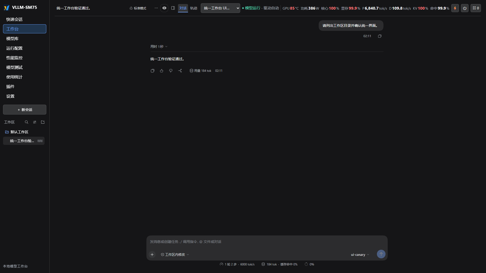

# v0.1.6 工作台整合验收

本次更新涉及 Ultra 管理界面、Harness 插件及发布资料，未重复长上下文或 GPU 性能测试。本轮已在独立实际镜像中完成界面验收，并更新本地正式界面。

## 统一界面

- 管理端口根地址承载现有 SM75 主界面。DSH 原生对话、工具、工作区与 Watcher 直接挂载在同一页面；旧 `/dsh/` 地址仅兼容已有书签。
- 主侧栏平级提供快速会话、工作台、模型库、运行配置、性能监控、模型测试、使用统计、插件和设置。列表与编辑表单使用主内容区全宽。
- 设置使用横向六页签：外观显示、助手工具、模型连接、参数模板、部署硬件、账号访问。尚未创建运行配置时，可先编辑部署与账号设置。
- 工作台会话工具并入高 64 px 的公共顶栏，与实时状态和指标保持单行。指标标签与单位默认 14 px，数值为 16 px 粗体等宽数字，状态文字为 15 px；随全局字号设置调整。全部指标完整显示，不横向滚动、不换行、不缩小字号；实际适用宽度由本轮浏览器测量记录确认。
- 全局字号统一作用于侧栏、普通按钮与输入框、配置表单、设置、原生工作台、Watcher、模型测试及监控图表。保留原有字号层级，侧栏默认基准为 16 px；可选 12–17，默认 14。修复连续调节被中间保存结果覆盖，以及图表重建后字号未恢复的问题。大字号使顶栏空间不足时，配置选择、任务与退出按钮使用现有主侧栏，仍可直接操作。同一窗口宽度和字号在各页面使用一致的空间预算，切换工作台不会临时增加配置栏或推移主导航。
- 使用统计由 Watcher 原生 Insights 提供，按 DSH 会话投影汇总。已加载的 Watcher 页面在切换时保留视图与状态，避免反复卸载重建。
- 原生会话、工具、设置与 WebSocket 生命周期继续由 Harness 管理；适配层对接主侧栏、公共顶栏和内容区域，并为管理控件与原生组件划分样式边界。
- 智能体默认使用简体中文，用户明确指定其他语言时遵从用户。原生 `list_directory` 使用官方文件系统接口列出当前会话工作区的文件、子目录和空目录，拒绝越界路径及指向工作区外的链接。
- 命令执行需要宿主提供可用的 Linux 安全沙盒。原生目录列表不改变默认权限，也不代表命令沙盒已恢复。

## 原生入口与加载反馈补充验收

使用统计与插件入口按固定面板标识导航，避免显示名称或语言变化导致标题切换但内容不变；原生切换失败时保留此前页面与地址。兼容尚未具备新状态读取方法的已加载布局。工作台与设置的原生组件实际挂载后才报告就绪；脚本加载超时、连接失效和设置加载失败会显示提示。

本次实际候选镜像确认工作台、Watcher、插件和外观显示、助手工具、模型连接均有实际内容；另验证失败注入、模拟会话与工具调用、草稿和节点保留。此前字号、主题及全部宽度矩阵保留为历史专项证据，本次没有重复这些矩阵。正式环境已定位到旧进程遗留的配置写入锁：锁持有进程不存在，但本地模型配置初始化因此失败，管理页一直等待就绪。已核对并将孤立锁备份后清理，原配置文件字节保持不变。实际隔离镜像复现相同故障，锁释放后无需重启 Harness 即恢复就绪和使用统计内容。正式就绪接口已恢复 HTTP 200、ready=true。正式已登录浏览器的完整交互检查未由自动化工具完成。

初始化接口增加安全的失败阶段和写锁超时标识；只对写锁超时进行限频、去重重试，不自动删除其他写入者的锁。配置监听限定为目标文件及必需的父目录，避免无关的受保护备份导致监听失败。

本轮另在实际候选镜像完成 1440 / 1600 / 1920 px × 字号 14 / 17 的 42 次页面切换检查：配置选择框、任务与退出控件的位置以及主导航纵坐标保持不变，只有一个配置选择框，选择值保留，指标全部单行可见。正式更新只替换前端脚本，没有重启 Harness 或模型。

## 缓存方案与布局

运行配置的“CPU KV 与分层缓存”通过“缓存方案”选择“默认”或“LMCache”，仅显示对应字段，统一保存到运行配置或个人模板。切换方案保留两套表单草稿；未失焦的输入也会保存。选择 LMCache 后，仅在完整校验通过时替换原生 CPU KV；自定义连接器和投机草稿不会被自动删除。

个人模板恢复其电源模式与 P-State 参数。自定义 offloading backend 的参数保留在高级参数中编辑和删除，便于处理缓存冲突。保存配置在模型下次启动时生效。

## 验证

验收使用独立数据目录与无 GPU 的 UI canary，通过合成 OpenAI 响应检查界面和调用链，不读取正式会话，也不作为模型性能测试。

| 检查 | 本轮结果 |
| --- | --- |
| 控制台 Node 回归、原生客户端构建检查 | 203 项中 196 通过、7 项环境相关跳过；69 个客户端校验通过 |
| 原生目录工具与工作区边界 | 现有回归通过；模拟会话与目录工具调用链通过 |
| 主侧栏、设置六页签、列表与编辑全宽 | 实际镜像通过；无底部弹出菜单或设置内侧栏 |
| 64 px 公共顶栏、单行完整指标、实际宽度和字号 | 字号 12 / 14 / 16 / 17 × 1440 / 1600 / 1920 px × 空闲 / 高数值 / 待采样，共 36 例；保留默认 14 / 16 px 指标层级并同比缩放，全部可见且无横向溢出 |
| 全页面字号、控件高度及图表 | 33 个页面状态、166 组主要字号、610 组文字控件比例通过；21 次开关及 108 项输入高度检查通过；真实 Chart.js 4.4.1 往返缩放与空闲检查通过 |
| Watcher 切页保留、插件、会话与工具 | 同一输入、会话框架与工具栏节点保留；草稿及对话/轨迹选择保留 |
| 设置持久化、主题、登录退出与代理鉴权 | 通过；主题/字号刷新后保留，Provider 草稿跨页保留，未知连接和异源入口被拒绝 |
| 正式静态资源及原生插件更新 | 与验收源码逐字节一致；69 个客户端校验通过，运行容器和 GPU 进程未重启 |
| Unraid 模板、图标、编辑能力和挂载保留 | 四份 XML 字节一致，托管/图标/WebUI 标签、环境和挂载一致 |

本轮结果见 [统一 UI 结构化结果](v0.1.6-unified-ui-results.json)。首次使用按原生声明确认完成、输入框可交互后验证，前次字号镜像的两次空数据启动均自动恢复工作区；本次入口修复镜像另完成一次新浏览器会话的自动恢复检查，能够输入并完成模拟会话。相同面板重复选择已做幂等处理，避免取消首次恢复。测试中的过早输入发生在原生遮罩仍禁用输入期间，未修改输入业务逻辑。上一轮记录保留在 [原生工作台历史结果](v0.1.6-native-shell-results.json)，其中旧布局与旧分辨率结论不作为本轮统一界面的验收依据。推理性能和上下文的历史结果继续以 [完整镜像报告](v0.1.6-full-images.md) 为准。

本地正式镜像为 `sha256:2f72e25bcaa491dafe4175afaff4a091841598f3901ff8988924bc7b42cca24e`。当前运行的 Ultra 保留原容器底层镜像，界面与原生插件已在线更新；下次重建容器使用新镜像。其余三份未启动定义已指向新镜像。测试容器及候选标签已清理，回滚备份保留。
